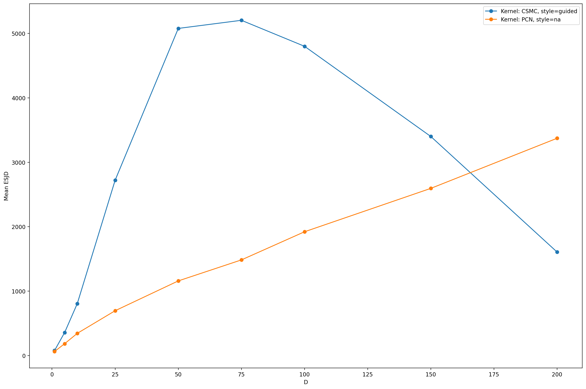
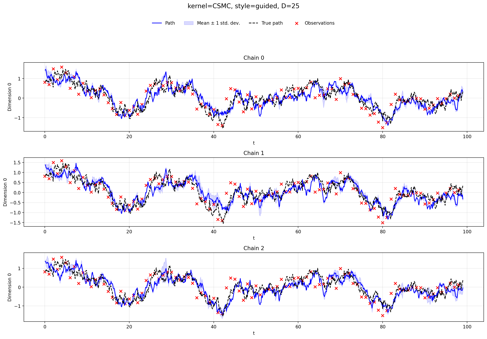
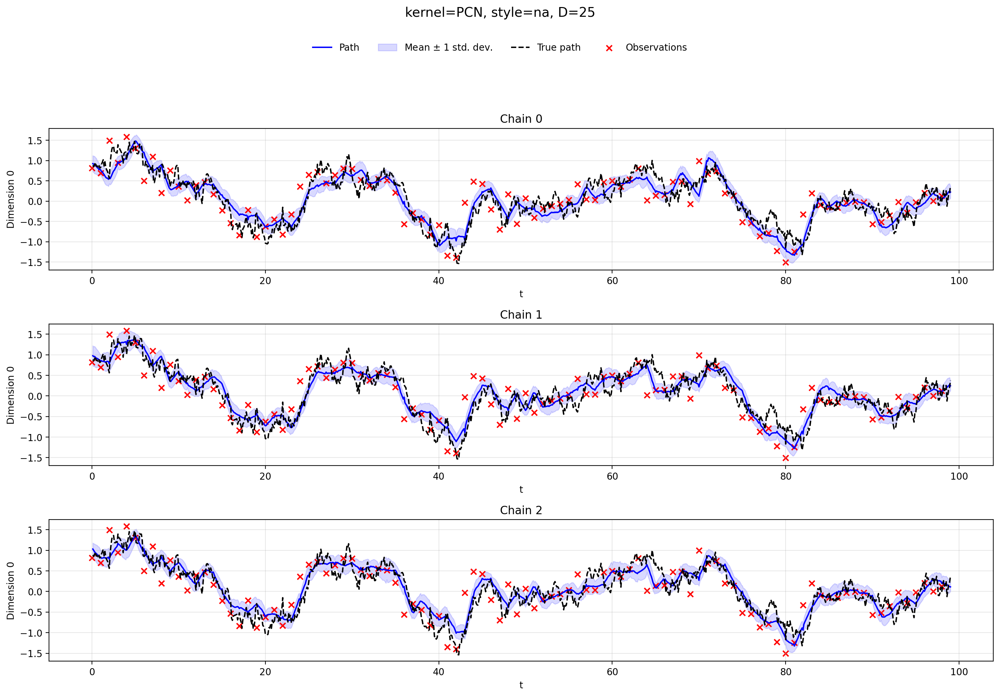

# Continuous-Discrete preconditioned Crank--Nicolson

This repository implements and experiments with **CD-pCN**, a local particle Markov kernel for smoothing in continuous-discrete state-space models (CD-SSMs).

The repository focuses on empirical comparison between transformed-space cSMC and CD-pCN on a continuous-time Ornstein--Uhlenbeck model. Full details of the algorithmic derivation are given in `cd_pcn.pdf`.

This project builds upon preliminary work by **Axel Finke and Adrien Corenflos (2024)** and **Christopher Stanton and Alexandros Beskos (2025)**. The code is also heavily inspired by the implementation style of Corenflos.

## Model

The experiments use a continuous-time linear Gaussian state-space model. The latent process is an Ornstein--Uhlenbeck diffusion,

$$
dX_t = -\phi X_t\,dt + \sigma_x\,dW_t,
$$

observed at discrete times through Gaussian measurements,

$$
Y_k \mid X_{t_k} \sim \mathcal N(X_{t_k}, \sigma_y^2 I).
$$

Each latent segment is represented in transformed form as

$$
z_t = (u_t, e_t),
$$

where $u_t$ is the Wiener-path component and $e_t = X(s_t)$ is the endpoint at observation time $s_t$. The Brownian path and endpoint are used to reconstruct the corresponding continuous-time bridge segment.


## Experiments

### 1. ESJD experiment

The ESJD experiment is the principal benchmark in this repository. It applies each kernel for one step, reconstructs the corresponding continuous-time paths, and records how far the reconstructed latent trajectory moves. This provides a direct diagnostic of local mixing: a kernel with larger ESJD is making larger moves through the smoothing distribution, subject to remaining stable and target-invariant.

For transformed CD-SSM states $z_t=(u_t,e_t)$, the continuous-time bridge segment is reconstructed as

$$
v_t = H_t(u_t; e_{t-1}, e_t),
$$

where $H_t$ maps the Wiener-path component and adjacent endpoints into the latent path segment over $[s_{t-1},s_t]$. For a Markov kernel producing a transition

$$
Z^{(m)}_{1:T}
\mapsto
\widetilde Z^{(m)}_{1:T},
$$

The reconstructed paths are written as

```math
V^{(m)}_{1:T}
=
H\!\left(Z^{(m)}_{1:T}\right),
\qquad
\widetilde V^{(m)}_{1:T}
=
H\!\left(\widetilde Z^{(m)}_{1:T}\right),
```
and the ESJD estimator is

```math
\widehat{\mathrm{ESJD}}
=
\frac{1}{M}
\sum_{m=1}^{M}
\left\|
\widetilde V^{(m)}_{1:T}
-
V^{(m)}_{1:T}
\right\|^2.
```

#### ESJD vs dimension

<p align="center">
  
</p>

---

### 2. Trace experiment

The trace experiment runs $M$ chains of repeated kernel applications. Each iteration consists of a filtering pass followed by backward sampling, producing a new smoothing trajectory sample. The resulting traces are used to inspect the behaviour of the Markov kernels over repeated applications, including ESS, mixing and convergence, and mean paths.

#### Mean path comparison

<p align="center">
  
  
</p>
---

### 3. Adaptation experiment

The adaptation experiment studies the tuning behaviour of the two CD-pCN parameters:

- $\delta_t$, controlling the Gaussian random-walk scale for endpoint moves;
- $\rho_t$, controlling the pCN correlation for Wiener-path moves.

The experiment targets a chosen acceptance rate and tracks how $\delta$ and $\rho$ evolve under the adaptation routine. Increasing $\delta$ makes endpoint proposals less local, while decreasing $\rho$ makes Wiener-path proposals less correlated with the current path. The purpose is to check adaptation of these parameters results in the expected decrease / increase in replacement rate of consecutive smoothing samples, as well as the how the parameters scale with dimension $D$.


## Repository structure

```text
CD-pCNL/
├── cd_ssm/
│   ├── adaptation.py          # Tuning routines for CD-pCN parameters
│   ├── bridge.py              # Bridge reconstruction from Wiener path and endpoints
│   ├── brownian.py            # Brownian path simulation utilities
│   ├── csmc.py                # Conditional SMC kernels
│   ├── delyon_hu.py           # Delyon--Hu correction terms
│   ├── euler.py               # Euler simulation and transition log-density utilities
│   ├── pcn.py                 # pCN proposal utilities
│   ├── t_cd_pcn.py            # CD-pCN kernel implementation
│   ├── t_csmc.py              # Transformed-space cSMC implementation
│   └── utils/
│       ├── kalman/
│       │   ├── filtering.py
│       │   ├── sampling.py
│       │   └── smoothing.py
│       ├── math.py
│       ├── plotting.py
│       ├── resamplings.py
│       └── printing.py
├── experiments/
│   └── ornstein_uhlenbeck/
│       ├── model.py           # Continuous-time LGSSM / OU model
│       ├── kernels.py         # Kernel construction for the OU experiments
│       ├── esjd/
│       │   ├── experiment.py  # One-step ESJD experiment
│       │   ├── analysis.py    # ESJD result aggregation and plotting
│       │   └── results/
│       ├── trace/
│       │   ├── experiment.py  # Repeated MCMC trace experiment
│       │   ├── analysis.py
│       │   └── results/
│       └── adaptation/
│           ├── experiment.py  # Delta/rho adaptation experiment
│           ├── analysis.py
│           └── results/
├── cd_pcn.pdf                 # Algorithm derivation and theoretical background
├── requirements.txt
├── setup.py
└── README.md